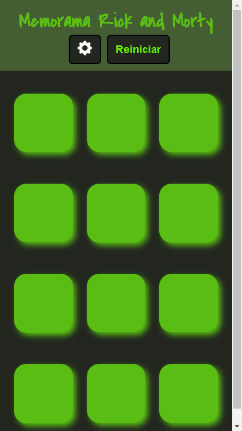

# Rick and morty Memorama o Pares
Un projecto creado para el Hackathon de GENTLEMAN, es mi primer proyecto sin seguir un toturial en especifico, no tengo mucha experiencia en el desarrollo web pero nadie nace sabiendo. Actualizacion: despues de varios meses logre implementar varias fulciones 
nuevas(se puede ver el archivo todo.txt), la mayor parte del codigo es espaguiti y no son las mejores practicas, espero conforme 
tenga mas experiencia hacerlo mejor. Este proyecto me hizo dar cuenta que me hace falta para poder seguir mejorando.
# **Deploy:**[RiackAndMorty](https://memorama-rick-and-morty.netlify.app/)

## Sobre el Proyecto
Consumo la api de Rick and Morty, la cual me dara una data que utilizare para hacer una baraja de cartas y jugar memorama o par.

Hacer un memorama que las cartes simpren sea es aburrido y no sacaria juego de la api, asi que el useFetch(CostunHook) hace una peticio que genera **una baraja de cartas aleatoriamente.** 

## Desing
### Desktop

### Movil

**Deploy:** [RiackAndMorty](https://memorama-rick-and-morty.netlify.app/)

## Instalcion 
~~~
npm install
npm run start
~~~
# Uso
Toca una carta y encuentra su pareja. no hay mucho misterio

